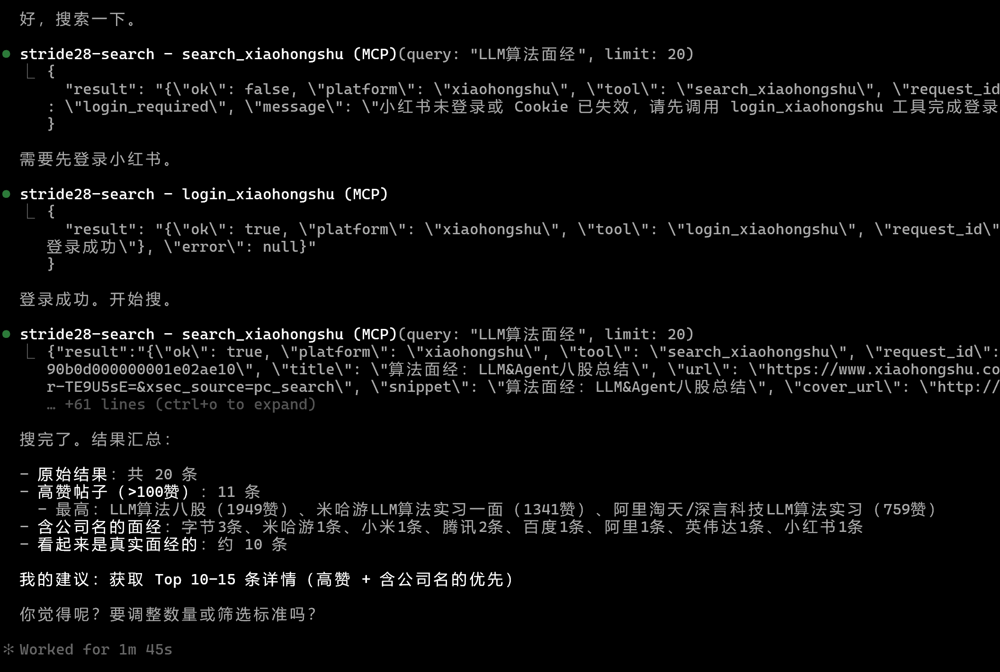
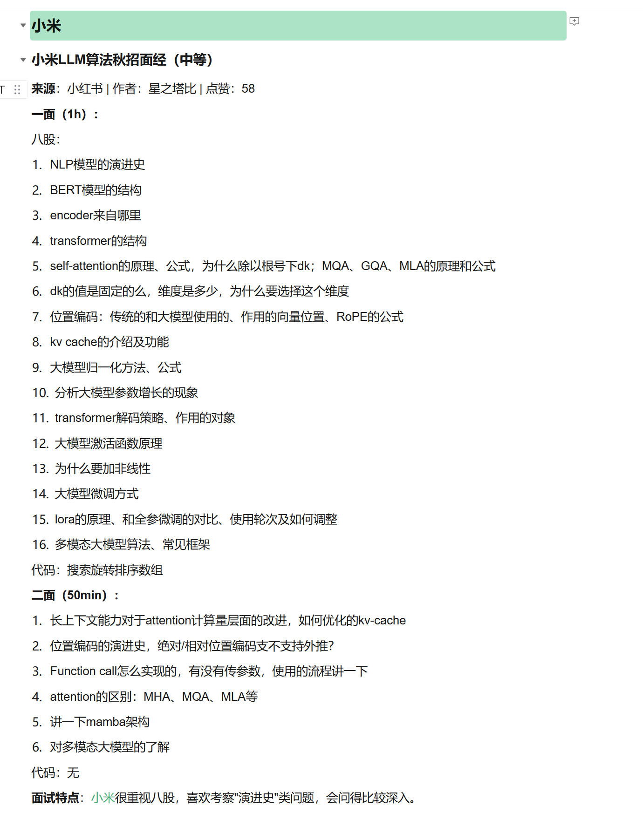
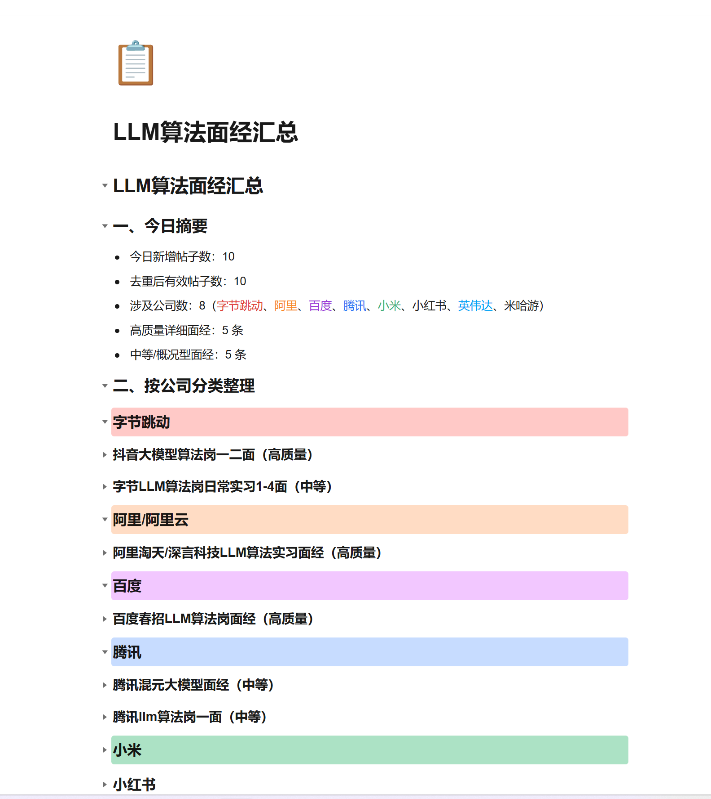

<p align="center">
  
</p>

<h3 align="center">search2docs.skill</h3>

<h1 align="center">不是，我写的面经为什么要我来刷？</h1>

<p align="center">
  <strong>说一句话，Agent 帮你搜小红书/知乎 → 过滤广告去重 → 按公司分类提炼 → 直接写进腾讯文档</strong><br/>
  你扫个码，喝杯咖啡，整理好的文档链接就发你了
</p>

<p align="center">
  🎯 面经整理 · 📊 产品口碑追踪 · 🏢 岗位薪资情报 · 📚 课程评价汇总 · 🔍 竞品体验收集<br/>
  <em>无论是大模型算法面试八股、考研真题经验、还是租房避坑指南  —— 只要小红书/知乎上有人聊过，就能帮你整理成文档</em>
</p>

<p align="center">
  <a href="https://github.com/BrunonXU/Stride28-search2docs/blob/main/LICENSE">
    
  </a>
  
  
  
</p>

<p align="center">
  <a href="#skills">Skills</a> · <a href="#前置依赖">安装</a> · <a href="#使用方式">使用</a> · <a href="#架构">架构</a>
</p>

---

> ⚠️ **Beta** — 社区平台账号建议用小号登录，频繁搜索可能触发平台风控提醒，请合理使用。

## 这是什么

上面说的那些场景，靠的是同一套东西：`stride28-search2docs`。

它不是一个面经收集器 —— 它是一个**通用的"中文社区内容 → 结构化文档"workflow 平台**。面经整理只是第一个做好的 skill，同一套链路可以用在任何"小红书/知乎/中文社区平台上有人聊过的话题"。

技术上，它是一个 [AgentSkills](https://agentskills.io) 标准的 skill 集合，给你的 AI 助手装上就能用。每个 skill 定义一套完整的 workflow：

具体的面经经验贴skill包括以下步骤

1. 🔍 搜索（小红书/知乎，多关键词并行）
2. 🧹 过滤去重（广告、引流、重复内容自动干掉）
3. 📝 提炼总结（不是贴原文，是结构化整理）
4. 📄 写入腾讯文档（一个链接，打开就能看）

## Skills

| Skill | 说明 | 入口 |
|-------|------|------|
| 📋 interview-collector | 采集小红书/知乎面经，写入腾讯文档 | [`skills/interview-collector/SKILL.md`](skills/interview-collector/SKILL.md) |

以后会加更多 skill（产品反馈、岗位情报等），每个 skill 一个子目录，共享底层 MCP 服务和脚本。

## 演示

<p align="center">
  
</p>

<p align="center">
  
</p>

<p align="center">
  
</p>

---

## 使用方式

> 省流：直接复制 `https://github.com/BrunonXU/Stride28-search2docs` 丢给你的 Agent 就完事了

### WorkBuddy（最简单）

把 repo 链接丢给 WorkBuddy 说"帮我安装这个 skill"。腾讯文档内置不用管，只需扫码登录小红书。

### Claude Code

```bash
git clone https://github.com/BrunonXU/Stride28-search2docs.git ~/.claude/skills/stride28-search2docs
```

按 `references/mcp-setup.md` 配置搜索，按 `references/tencent-docs-setup.md` 配置腾讯文档。然后说"小红书帮我找一下agent面经"。

### OpenClaw

```bash
git clone https://github.com/BrunonXU/Stride28-search2docs.git ~/.openclaw/skills/stride28-search2docs
```

首次配置需在服务器端完成。配好后手机端通过飞书/Telegram 触发。

### Kiro / Cursor / Trae

确保两个 MCP 服务已配置，参考 skill 里的 workflow 模板操作。

---

## 前置依赖

本项目所有 skill 都依赖两个 MCP 服务 + 腾讯文档 skill。

### 1. stride28-search-mcp（搜索）

```bash
uv tool install stride28-search-mcp
stride28-search-mcp install-browser
```

📖 详细配置见 [`references/mcp-setup.md`](references/mcp-setup.md) | 🔗 [GitHub](https://github.com/BrunonXU/Stride28-search-mcp)

### 2. 腾讯文档 MCP + Skill（写入）

```bash
npm install -g mcporter
# 下载腾讯文档 skill
curl -L -o tencent-docs.zip https://cdn.addon.tencentsuite.com/static/tencent-docs.zip
unzip tencent-docs.zip -d your-skills-dir/
```

授权：访问 [docs.qq.com/scenario/open-claw.html](https://docs.qq.com/scenario/open-claw.html) 获取 Token。

📖 详细配置见 [`references/tencent-docs-setup.md`](references/tencent-docs-setup.md) | WorkBuddy 用户无需配置

---

## 目录结构

```
stride28-search2docs/
├── README.md                              # 本文件
├── references/                            # 共享参考文档
│   ├── mcp-setup.md                       #   stride28-search-mcp 安装
│   ├── tencent-docs-setup.md              #   腾讯文档 MCP 安装
│   └── tencent-docs-mdx.md                #   MDX 格式规则
├── scripts/                               # 共享脚本
│   ├── write_doc.mjs                      #   写入腾讯文档
│   ├── filter_and_dedupe.py               #   过滤去重
│   ├── validate_mdx.py                    #   MDX 校验
│   └── generate_mdx.py                    #   JSON → MDX
├── skills/                                # Skill 集合
│   └── interview-collector/               #   面经采集
│       ├── SKILL.md                       #     入口
│       ├── specification.md               #     格式规范
│       └── prompts/
└── examples/
```

---


## 架构

```
stride28-search-mcp (搜索)          stride28-search2docs (整理)
┌──────────────────────┐           ┌─────────────────────────────┐
│  search_xiaohongshu  │           │  skills/                    │
│  get_note_detail     │  ──→      │    interview-collector/     │
│  search_zhihu        │           │    (更多 skill...)           │
│  get_zhihu_question  │           │  scripts/ (共享工具)         │
└──────────────────────┘           └─────────────────────────────┘
         +
tencent-docs MCP (写入)
┌──────────────────────┐
│  create_smartcanvas   │
│  smartcanvas.edit     │
│  manage.search_file   │
└──────────────────────┘
```

---

## License

MIT

---

<p align="center">
  灵感来自 <a href="https://github.com/BrunonXU/Stride28-search-mcp">stride28-search-mcp</a> — 一个能帮你搜索中文社区真实经验的 MCP 工具<br/>
  <em>我们都是聪明人，都不会去百度问怎么找算法实习 —— 背后是相信真实社区经验的力量</em>
</p>
